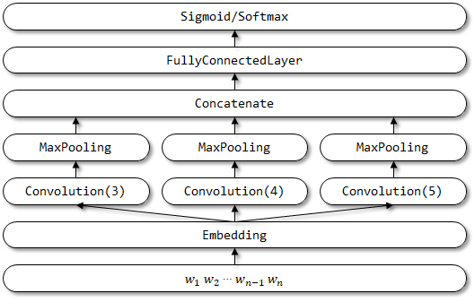
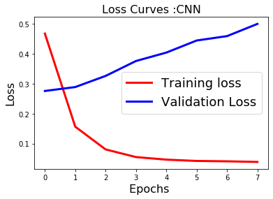
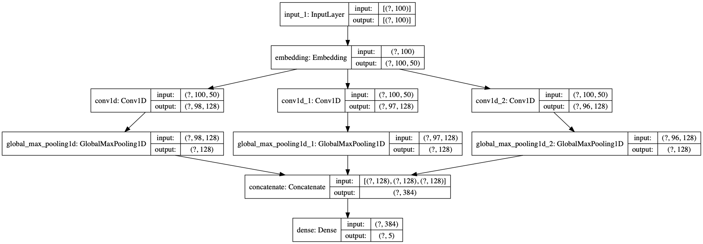

# 菜鸟也能玩转NLP-卷积神经网络文本分类
**[云润人工智能部门](https://my-website-six.now.sh/)《NLP零基础快速上手教程》课程资料 by [算法工程师:招晓贤](https://github.com/flybirdgroup)**
<!--truncate-->
# 菜鸟也能玩转NLP-卷积神经网络文本分类
**[云润人工智能部门](https://my-website-six.now.sh/)《NLP零基础快速上手教程》课程资料 by [算法工程师:招晓贤](https://github.com/flybirdgroup)**

## 原理讲解
TextCNN出处：论文[Convolutional Neural Networks for Sentence Classification](http://www.aclweb.org/anthology/D14-1181)

### 论文核心点


1. Represent sentence with **static and non-static channels**.
2. **Convolve** with multiple filter widths and feature maps.
3. Use **max-over-time pooling**.
4. Use **fully connected layer** with **dropout** and **softmax** ouput.

### TextCNN基础知识
#### 词向量
1. 随机初始化
2. 预训练词向量进行初始化,在训练过程中固定(CNN-static),注意与图像CNN的不同
3. 预训练词向量进行初始化,在训练过程中微调(CNN-non-static)
4. 多通道(CNN-multichannel):将固定的预训练词向量和微调的词向量分别作为一个通道(channel),卷积操作同时在两个通道上进行,可以类比图像RGB三通道

#### 详细说明
1. 上图的图片为例,句子长度为n=9,词向量维度k为6,filter有两种窗口大小,每种有2个,所以filter有4个.
2. 红色框的为h=2,卷积后的向量维度为n-h+1=9-2+1=8
3. 黄色框h=3,卷积后的向量维度是n-h+1=9-3+1=7 (论文原图少画了一个维度)

### 项目实现

TextCNN 的网络结构：





## 模型构建与训练

### 1.定义网络结构


```python
from tensorflow.keras import Input, Model
from tensorflow.keras.layers import Embedding, Dense, Conv1D, GlobalMaxPooling1D, Concatenate, Dropout

#重要参数解释
#maxlen:句子最大长度
#max_features:词典最大数量
# embeding_dims:词向量维度数
#class_num: 分类数
#last_activation:激活函数

class TextCNN(object):
    def __init__(self, maxlen, max_features, embedding_dims,
                 class_num=5,
                 last_activation='softmax'):
        self.maxlen = maxlen
        self.max_features = max_features
        self.embedding_dims = embedding_dims
        self.class_num = class_num
        self.last_activation = last_activation

    def get_model(self):
        input = Input((self.maxlen,))
        embedding = Embedding(self.max_features, self.embedding_dims, input_length=self.maxlen)(input)
        convs = []
        for kernel_size in [3, 4, 5]:
            c = Conv1D(128, kernel_size, activation='relu')(embedding)
            c = GlobalMaxPooling1D()(c)
            convs.append(c)
        x = Concatenate()(convs)

        output = Dense(self.class_num, activation=self.last_activation)(x)
        model = Model(inputs=input, outputs=output)
        return model
```

### 2.数据处理与训练


```python
from tensorflow.keras.preprocessing import sequence
import random
from sklearn.model_selection import train_test_split
from tensorflow.keras.callbacks import EarlyStopping, ModelCheckpoint
from tensorflow.keras.utils import to_categorical
from utils import *

# 路径等配置
data_dir = "./processed_data"
vocab_file = "./vocab/vocab.txt"
vocab_size = 40000

# 神经网络配置
max_features = 40001
maxlen = 100
batch_size = 64
embedding_dims = 50
epochs = 8

print('数据预处理与加载数据...')
# 如果不存在词汇表，重建
if not os.path.exists(vocab_file):  
    build_vocab(data_dir, vocab_file, vocab_size)
# 获得 词汇/类别 与id映射字典
categories, cat_to_id = read_category()
words, word_to_id = read_vocab(vocab_file)

# 全部数据
x, y = read_files(data_dir)
data = list(zip(x,y))
del x,y
# 乱序
random.shuffle(data)
# 切分训练集和测试集
train_data, test_data = train_test_split(data)
# 对文本的词id和类别id进行编码
x_train = encode_sentences([content[0] for content in train_data], word_to_id)
y_train = to_categorical(encode_cate([content[1] for content in train_data], cat_to_id))
x_test = encode_sentences([content[0] for content in test_data], word_to_id)
y_test = to_categorical(encode_cate([content[1] for content in test_data], cat_to_id))

print('对序列做padding，保证是 samples*timestep 的维度')
x_train = sequence.pad_sequences(x_train, maxlen=maxlen)
x_test = sequence.pad_sequences(x_test, maxlen=maxlen)
print('x_train shape:', x_train.shape)
print('x_test shape:', x_test.shape)

print('构建模型...')
model = TextCNN(maxlen, max_features, embedding_dims).get_model()
model.compile('adam', 'categorical_crossentropy', metrics=['accuracy'])

print('训练...')
# 设定callbacks回调函数
my_callbacks = [
    ModelCheckpoint('./cnn_model.h5', verbose=1),
    EarlyStopping(monitor='val_accuracy', patience=2, mode='max')
]

# fit拟合数据
history = model.fit(x_train, y_train,
          batch_size=batch_size,
          epochs=epochs,
          callbacks=my_callbacks,
          validation_data=(x_test, y_test))

#print('对测试集预测...')
#result = model.predict(x_test)
```


### 3.训练中间信息输出


```python
import matplotlib.pyplot as plt
plt.switch_backend('agg')
%matplotlib inline

fig1 = plt.figure()
plt.plot(history.history['loss'],'r',linewidth=3.0)
plt.plot(history.history['val_loss'],'b',linewidth=3.0)
plt.legend(['Training loss', 'Validation Loss'],fontsize=18)
plt.xlabel('Epochs ',fontsize=16)
plt.ylabel('Loss',fontsize=16)
plt.title('Loss Curves :CNN',fontsize=16)
fig1.savefig('loss_cnn.png')
plt.show()
```


```python
fig2=plt.figure()
plt.plot(history.history['acc'],'r',linewidth=3.0)
plt.plot(history.history['val_acc'],'b',linewidth=3.0)
plt.legend(['Training Accuracy', 'Validation Accuracy'],fontsize=18)
plt.xlabel('Epochs ',fontsize=16)
plt.ylabel('Accuracy',fontsize=16)
plt.title('Accuracy Curves : CNN',fontsize=16)
fig2.savefig('accuracy_cnn.png')
plt.show()
```


### 4.模型结构打印


```python
from tensorflow.keras.utils import plot_model
plot_model(model, show_shapes=True, show_layer_names=True)
```



### 5.模型导出
```python
import tensorflow as tf
import shutil 
model = tf.keras.models.load_model('./cnn_model.h5')
```

### 6.预测模型
```python
import jieba
text = "杨幂好漂亮,发生原子弹"
print(jieba.lcut(text))
text_seg = encode_sentences([jieba.lcut(text)], word_to_id)
text_input = sequence.pad_sequences(text_seg, maxlen=maxlen)
print(model.predict(text_input))
```

###   7.前后端结合+docker部署
项目demo：docker部署链接:[中文新闻多分类demo](https://hub.docker.com/repository/docker/flybirdgroup/classifier)

`docker启动命令`
```python
docker run -p 127.0.0.1:80:5000/tcp flybirdgroup/classifier
```


