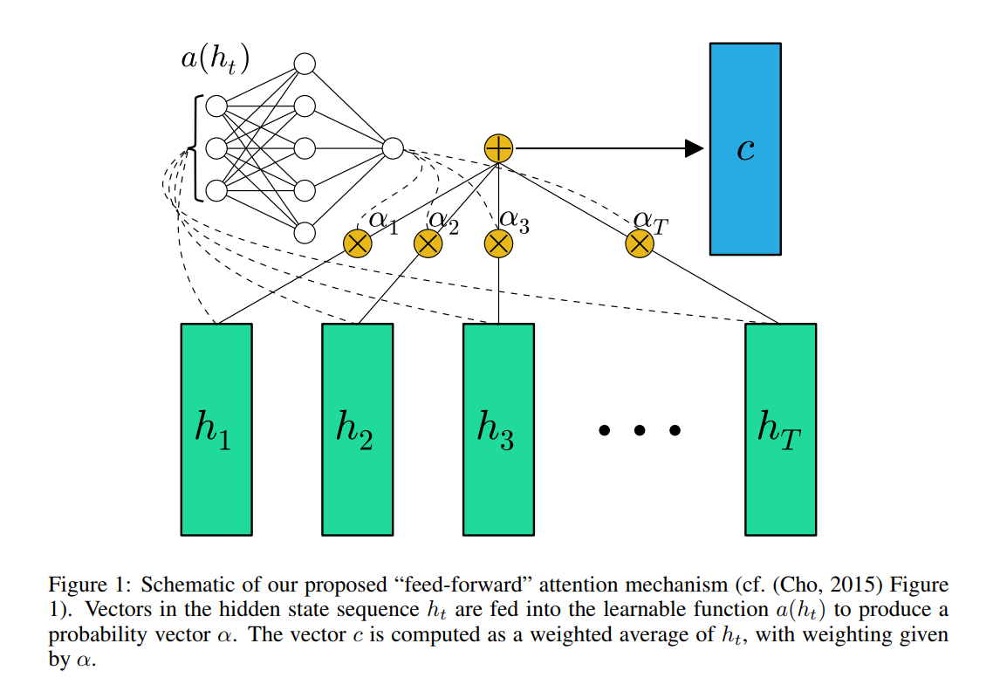
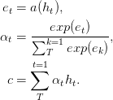
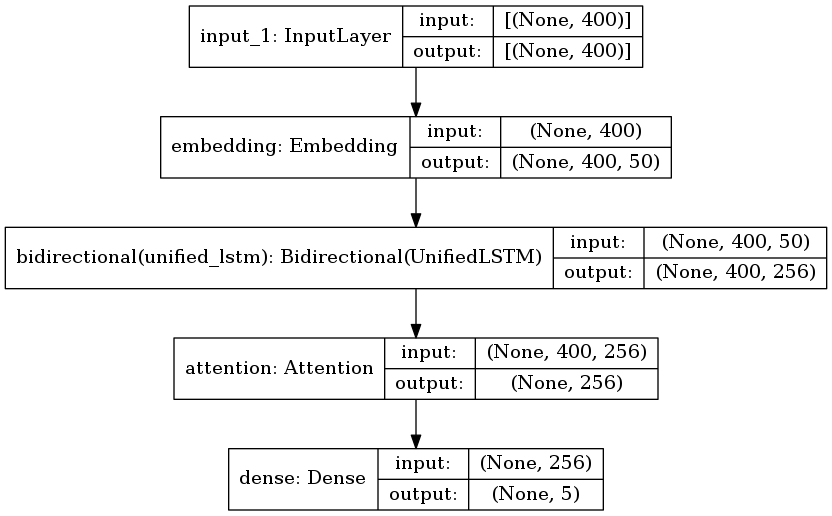

## 原理讲解

TextAttBiRNN是在双向LSTM文本分类模型的基础上改进的，主要是引入了注意力机制（Attention）。对于双向LSTM编码得到的表征向量，模型能够通过注意力机制，关注与决策最相关的信息。其中注意力机制最先在论文 [Neural Machine Translation by Jointly Learning to Align and Translate](https://arxiv.org/pdf/1409.0473.pdf) 中被提出，而此处对于注意力机制的实现参照了论文 [Feed-Forward Networks with Attention Can Solve Some Long-Term Memory Problems](https://arxiv.org/pdf/1512.08756.pdf)。
<!--truncate-->
注意力机制参考
- [深度学习中的注意力模型](https://zhuanlan.zhihu.com/p/37601161)
- [深度学习注意力机制](https://zhuanlan.zhihu.com/p/53036028)

请注意,这里的注意力机制与bert中transformer的注意力机制不同,transformer会更加复杂,大家可以参考我关于[transformer]的文章(https://github.com/weijiang2009/URun.ResearchPrototype/tree/dev/People/Xiaoxian/NLP%E5%9F%BA%E7%A1%80%E7%9F%A5%E8%AF%86%E6%95%B4%E7%90%86/Transformer%E7%AC%94%E8%AE%B0)

In the paper [Feed-Forward Networks with Attention Can Solve Some Long-Term Memory Problems](https://arxiv.org/pdf/1512.08756.pdf), the **feed forward attention** is simplified as follows,

Function a, a learnable function, is recognized as a feed forward network. In this formulation, attention can be seen as producing a fixed-length embedding c of the input sequence by computing an adaptive weighted average of the state sequence h.

c就是注意力,alpha就是权重,h就是隐含状态,alpha通过softmax计算,score就是通过h计算的,h就是当前状态输入的词语和上一隐含状态ht-1计算而来的

## 细看结构
TextAttBiRNN 的网络结构

### 输入层
输入层我们可以定义为句子输入长度，每个词经过一个embedding_dim=50的embedding矩阵，最终输出400×50的表示矩阵.假设一个句子有400个词语

### Bi-LSTM
Bi-LSTM层作为一种特征编码层，这层可以提取每个词语的上下文特征，然后将双向的特征进行拼接，然后依旧将每个词语的特征进行输出，因此输出为400×256的特征矩阵

Attention层
Attention层对这个网络中对每个词语进行了加权求和，这个权重是通过训练不断训练出来的，这层我们的输入x为400×256，我们初始化权重矩阵W为256×1维，然后对x与W进行点乘、归一化（公式的前两个），这样就可以得到400×1的矩阵a，这个矩阵代表的是每个词对应的权重，权重大的词代表注意力大的，这个词的贡献程度更大，最后对每个词语进行加权平均，aT与x进行点乘，得到1×256，这是最终加权平均后输出的总特征向量。

输出层
与我之前textCNN做中文新闻分类实验差不多，使用全连接层，softmax作为激活函数进行输出。

